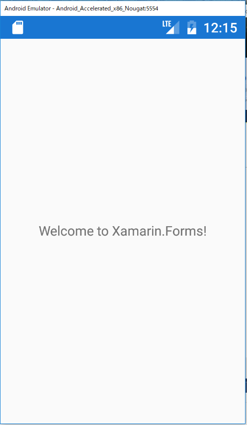
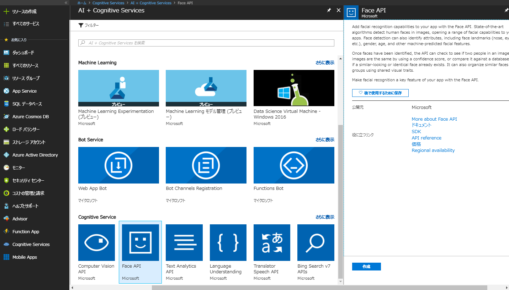
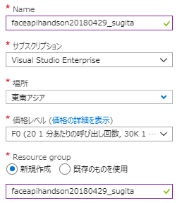

# Module0: 環境準備

## 1. Xamarin.Formsの空プロジェクト（Blank Forms）のビルド

### プロジェクトテンプレートの追加

アプリを開発していくにあたり、プロジェクトのテンプレートを追加します。Visual Studioを開き、**ファイル** -> **新規作成** -> **プロジェクト**を選択してください。

つぎに、**Visual C#** -> **Cross-Platform** -> Mobile App(Xamarin.Forms)を選択してください。

プロジェクトテンプレートは**Blank App**を、Code Sharing Strategyは**.NET Standard**を選択してください。

### ビルドの確認

ここで一度ビルドできるか確認します。Android、iOSのいずれかのプロジェクトをスタートアッププロジェクトに設定してください。

つぎに、エミュレータを選択してビルドしてください。

エミュレータが立ち上がり、Welcome to Xamarin.Forms!が表示されればOKです。

## 2. Face APIのAPIキー取得

Face APIを利用するためにAPIキーを取得します。

### Azure Portalから取得する場合

つぎのURLからAzureのポータルにログインしてください。
https://azure.microsoft.com/ja-jp/features/azure-portal/

すべてのサービスから***Cognitive Services**を選択し、**Face API**の**作成**をクリックしてください。

つぎのように入力し、**作成**をクリックしてください。

デプロイしたリソースに移動し、**keys**をクリックするとAPIキーが確認できます。

### Cognitive Services専用ページから取得する場合

つぎのURLにアクセスし、**Face API**の**APIキーを取得**をくりっくしてください。
https://azure.microsoft.com/ja-jp/try/cognitive-services/?api=face-api

使用条件に同意し、任意のアカウント（Microsoft、Facebook、LinkedIn、GitHub）を選択ししてください。

APIキーとエンドポイントが確認できます。

こちらのサイト経由の場合、有効期間は7日間です。

---
[Back](README.md) | [Next](module1.md)
