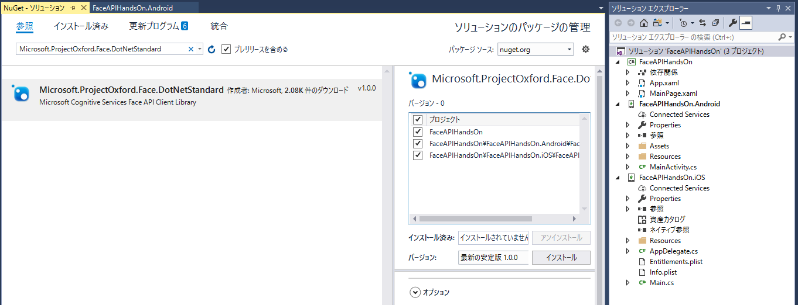

# Module1: ライブラリの追加

開発で仕様するライブラリをnugetから取得しプロジェクトに追加します

## 1. Face APIのSDKの追加

NuGetでFace APIのSDKを追加します。ソリューションを右クリックし、**ソリューションのNuGetパッケージの管理**をクリックしてください。

**参照**タブを選択し、検索フィールドに`Microsoft.ProjectOxford.Face`を入力してください。

**Microsoft.ProjectOxford.Face.DotNetStandard**を選択し、**プロジェクト**をチェックし、**インストール**をクリックしてください。

※Visual Studioのバージョンの関係等でCode Sharing Strategyを**Portal Class Library**を選択している方は**Microsoft.ProjectOxford.Face**をインストールしてください。

## 2. ネットワーク可能性チェック用ライブラリの追加

1と同様にNuGetでライブラリを追加します。**Xam.Plugin.Connectivity**をインストールしてください。

## 3. 写真の撮影、選択用ライブラリの追加

1、2と同様にNuGetでライブラリを追加します。**Xam.Plugin.Media**をインストールしてください。

---
[Back](module0.md) | [Next](module2.md)
